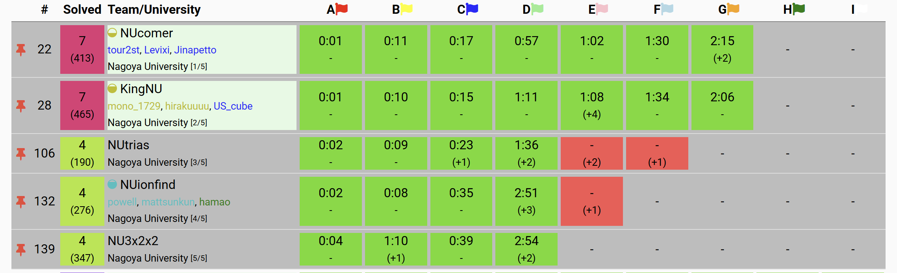

ICPC国内予選に参加しました（今年で 4 回目かつラストイヤーです）． 
チーム KingNU で参加し，全体28位，学内2位で予選を通過しました！

<figcaption class="text-center">
名大のチーム（今年は名古屋大学から過去最多の 5 チームが参加しました！）
</figcaption>

## チーム紹介

- [hirakuuuu (筆者)](https://atcoder.jp/users/hirakuuuu): 
  - M1
  - ABC芸人1
  - 青黄反復村
  - ARCが全くできない（rated 8連敗）
- [mono_1729](https://atcoder.jp/users/mono_1729):
  - M1
  - 唯一ARCで勝てる
  - 考察が重い問題は全部やってもらう
  - 期待値が好き
- [US_cube](https://atcoder.jp/users/US_cube): 
  - B3
  - 今年名大に編入してきた
  - ABC芸人2
  - 名前的に US 配列使いかと思ったら JIS 配列だった
    - 他二人が US 配列なので合わせてもらいました
    - でも普通に実装はやくてびっくり

全員一昨年は横浜に行って，去年は国内予選で落ちていたので，今年はリベンジに燃えていました．

うちのチームはレート順でいえば名古屋大学の一番手ですが，二番手のチーム（NUcomer）との差はほとんどなく，通過ラインとしては
- NUcomer に勝てば通過はほぼ確定
- 負けたとしても，50位以内くらいに入れば通過できそう

くらいの感覚でいました．

## 練習

[NUCODER](https://x.com/NUCODER3) (名古屋大の競プロサークル) の活動として，過去問でバチャをやって感想戦をしたりしてました．
この時点で NUcomer とは勝ったり負けたりだったので，実力的には互角だなと思っていました．
また，直前の1週間は mono_1729 が毎日バチャを走っていて，僕も参加できるときは参加するという感じでやってました．

## 模擬国内

僕は参加できなかったのですが，他二人が参加してくれて 33 位（通過順位は 21 位）だったそうです．
構文解析が出たと聞いて，本番で出たらどうしようと思っていました．

## 国内予選

#### 本番前

毎回コンテスト前は緊張で吐き気に襲われるのですが，研究室で吐きそうになっているところを友達に心配されていました．

#### A（hirakuuuu）

二重ループを書いてる途中に定数時間で解けると気づきましたが，そのまま書いて出しました．(0:01)

#### B (US_cube)

問題文の印刷がまだだったので全員で見つつ，難なく通りました．(0:10) 
このあたりで問題文の印刷が終わりました．

#### C (hirakuuuu)

B の実装中に立式できていたので，すぐ通りました．(0:15)

#### E (mono_1729)

4ペナしながら通してくれました．
途中，保存し忘れてペナを出したりしていたので，落ち着いてくれ～と思っていました．(1:08 +4)

後から聞いたら，木が与えられるという設定を読んでいなかったり，だいぶ複雑な方針を引いていて，よく通ったなと思いました．

#### D (hirakuuuu, US_cube)

やばそうな見た目だったので，慎重に方針を立てました．
各行・各列について，色が変わる位置を求めて，あとはその位置や幅の整合性の判定を頑張ると解けそうとなりました．
US_cube さんに細かい部分を詰めてもらいつつ，自分は F の問題文を読んでました（左右盲のせいで読解にかなり時間がかかってしまった）．

実装はペアプロでやりました．
基本的には US_cube さんに実装してもらい，僕は横でミスがないかをチェックしてました．
沼るとやばそうな問題だったので，これは良い判断だった気がします．
サンプルで落ちながらも，すぐ修正してAC．(1:11)

#### F (mono_1729)

構築はやりたくなかったので，E を解き終わった mono_1729 に問題を説明して投げました．
気づいたら通っててすげーとなりました．(1:34)

#### G (全員)

最初は僕と US_cube さんで考察していました．
平行な辺どうしは四角形の面で，それ以外は三角形二つになりそう？というところで詰まってました．

Fを解き終わった mono_1729 が上界が $n+m+2$ であることを教えてくれて，あとは平行な辺のペアの数を数えてそれを引けば良さそうとなりました．
その通り実装したら通りました．(2:06)

この時点で全体 16 位で通過をほぼ確信しました．
急に緊張の糸が解けたせいか，数分間心臓の痛みに襲われました．

#### H, I（解けず）

G を通したすぐ後に，同大学の NUcomer も 7 完していて，ペナ差で負けていたので，切り替えて 8 完を目指しました．

H は `((` から `))` にたどり着ければよさそうで，それ以外は `()()...()` と交互に並んでいるけど，どう数え上げるか分からんという感じでした．

I は数字の重複は消せるというところまでしか分かりませんでした．

## 結果・感想

7完 28 位でした．
セットはやや易しめだったようですが，過去問でも7完できたことがなかったので，かなり嬉しかったです．
ただ，NUcomer には負けたのだけは悔しいですね．

とはいえ，名古屋大学から30位以内に2チーム入ったのはおそらく初だと思うので，自分たちのレベルが上がったのを感じました．
モチベもだいぶ上がったので，横浜に向けて，まずは ARC で勝てるように頑張りたいと思います．
